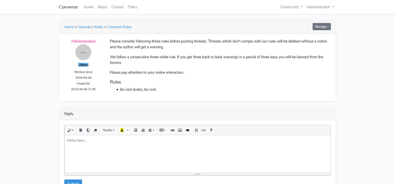

# Converse

Converse is a forum engine that is based on Laravel.

Brief features are installation wizard, role editor, summernote implementation ...

## Installation

Converse uses PHP 7.3.8, MySQL 8.0.17, Laravel 6.0, Composer 1.8.6.

Download the source and extract it.

Go to the source path where you can see *composer.json* file and run below command:

`composer update`

Create a database and tweak the configuration in your *.env* file for database connection then run following command to migrate database tables:

`php artisan migrate`

Next we have to make a symbolic link for storage folder by running following command:

`php artisan storage:link`

You can use NGINX or Apache as your webserver, but you can also use PHP's development server for testing purposes by going to source path and running the below command like so:

`php artisan serve`

After you are satisfied with the web server of your choice go the host address that is running Converse in your browser and you will be prompted with the installation message.

For example, let's say you have started Converse via PHP's development server, you can go to http://localhost:8000/install to proceed with the installation.

Installation wizard makes a seal proof file at *storage/app/installation* so we can tell if installation is already done. There is also an *options.json* file which stores Converse configuration.

After installation you are going to be logged in as administration to make changes.

One last thing to mention is queued jobs. Emails sent for thread subscription are queued as jobs in the database. For these jobs to be processed, run the following command to start a queue worker:

`php artisan queue:work`

Note that once the `queue:work` command has started, it will continue to run until it is manually stopped or you close your terminal.

## Re-installation

If you want to perform a re-installation for any purpose you can delete installation seal proof file and run the following command:

`php artisan migrate:fresh`

Then you can go to */install* route on your host to perform a fresh installation.

Remember to run the following command to restart the queue workers if you have any:

`php artisan queue:restart`

## Deployment

If you are willing to deploy, you can follow [deployment instructions](https://laravel.com/docs/6.0/deployment) on Laravel's website to have a better performance.

## Features

- Installation wizard.
- User editor with role assignment.
- Role editor for different authorization rules.
- Dynamic menu and page editor.
- Categorization of topics and threads.
- Direct messaging.
- Profile editor.
- User ban.
- Thread closing, pinning.
- Thread subscription.
- Favorite threads list.
- In-place content management.
- Easy to use [summrnote](https://summernote.org/) WYSIWYG editor implementation for pages, threads and comments.
- Human friendly URLs.
- Background customizations.
- Cookie consent notice display.
